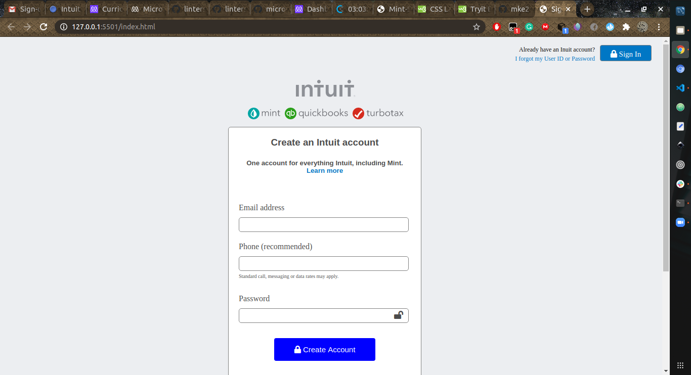

# Sign-Up Form

> The clone of the Sign-up form for Intuit. The design is as required by microverse's second project.

The design was a basic introduction to the input addition into HTML. Designs are powered by only CSS.

## Built With

- HTML
- CSS

## Live Demo

[Live Demo Link](https://mke2111.github.io/SignUpCR1230/)

## Authors

👤 **Author1**

- GitHub: [@mke2111](https://github.com/mke2111)
- Twitter: [@Roymkenya](https://twitter.com/Roymkenya)
- LinkedIn: [Roy Mukuye](https://www.linkedin.com/in/roy-mukuye-42b07b1b4)

👤 **Author2**

- GitHub: [@che30](https://github.com/che30)
- Twitter: [@BlanchardNsoh](https://twitter.com/BlanchardNsoh)
- LinkedIn: [che nsoh](https://www.linkedin.com/in/che-nsoh-9455271b0/)

## 🤝 Contributing

Contributions, issues, and feature requests are welcome!

Feel free to check the [issues page](issues/).

## Show your support

Give a ⭐️ if you like this project!

## Acknowledgments

- Hat tip to anyone whose code was used
- Inspiration
- etc

## 📝 License

This project is [MIT](lic.url) licensed.